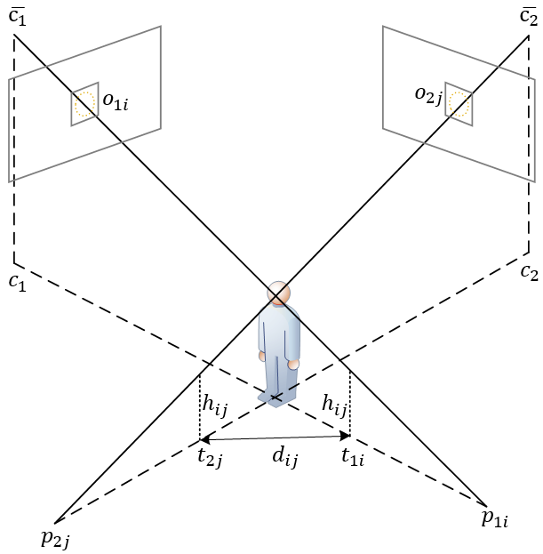

Geometrical Matching
======
 [](https://github.com/inspiros/geo_lsqlsa/blob/master/LICENSE.txt)

This project reimplements a geometrical analysis-based algorithm, dubbed ``geo_lsqlsa``, for matching and localization
of object detection results from multiple fixed cameras, which I developed while working at
**Samsung Display Vietnam (SDV)**, under a collaboration project with **HUST**.

The original code, as well as all the image data used for development, now reside at SDV and cannot be copied outside.
However, I reserve the right to share this _(slightly modified)_ algorithm with those who are interested,
especially developers.

## Main Ideas

### Problem Formulation

For simplicity, we first consider the two views problem.
Let us denote the two cameras with $c1$ and $c2$, each installed with an object detector.
We define $O_1 = \left(o_{11}, o_{12}, \cdots, o_{1n}\right)$ and
$O_2 = \left(o_{21}, o_{22}, \cdots, o_{2m}\right)$ as sets of detection results
from $c1$ and $c2$ respectively.
Optionally, we may also constrain $O_1$ and $O_2$ belonging to the same class.
Given that instances of the detected objects are visually similar, we want to find all assignments between
$o_{1i}$ and $o_{2j}$, which are bounding boxes of the same instance.

#### Relation with Object Re-identification

Matching object detection results between different views can be interpreted as a re-identification problem.
In our specific settings, distribution of detected objects is highly dense, and they look almost identical
(i.e. workers wearing uniforms, including headwears), thus, visual clues-based deep reId techniques are rendered
unreliable.

### Methodology

Our method is inspired by the one described in the paper [A Robust Approach for Person Localization in Multi-camera Environment](https://ieeexplore.ieee.org/document/5597390),
in which the authors proposed to use the foreground-extracted silhouette of people for localization.

<p align="center">
    
</p>

We define $\bar{c_1}=(c_1^{(x)}, c_1^{(y)}, z_1)$ and $\bar{c_2}=(c_2^{(x)}, c_2^{(y)}, z_2)$ as measured coordinates of
the two cameras with $z_1$ and $z_2$ are their corresponding heights; $\underline{c_1}=(c_1^{(x)}, c_1^{(y)}, 0)$ and
$\underline{c_2}=(c_2^{(x)}, c_2^{(y)}, 0)$ are their ground projections; $p_{1i}$ and $p_{2j}$ are intersections between
the rays $\bar{c_1}o_{1i}$ and $\bar{c_2}o_{2j}$ with the ground plane $z = 0$, respectively.
While $\bar{c_1}, \bar{c_2}$ are fixed, the two points $p_{1i}, p_{2j}$ can be calculated directly from pixel
coordinates of $o_{1i}, o_{2j}$ using calibration method and substituting $p^{(z)}=0$ in the camera equation:

```math
\left[\begin{array}{c}p^{(x)} \\ p^{(y)} \\ p^{(z)}\end{array}\right] = R^{-1} \left(K^{-1} s\left[\begin{array}{c}o^{(x)} \\ o^{(y)} \\ 1\end{array}\right] - t\right)
```

Aside from fixed cameras' positions, our approach is also limited by another geometrical assumption of the detected
object.
In essence, the rays through a chosen keypoint captured from all views of the object
must intersect at the same point in 3D coordinates, dubbed _center of the object_.
We choose the keypoint to be the center of the bounding box, thus, imposing a symmetrical constraint on the
detected object (as hooded human's head resembles a perfect sphere).

We assume the height _(from ground to the center)_ of the object (human head in our case) is $h_{ij}$ satisfies
$h_{ij} \ge 0$.
With each value of $h_{ij}$ we can find only one pair of $t_{1i}$ and $t_{2j}$ lying on the lines $c_1p_{1i}$ and
$c_2p_{2j}$.
In a perfect match, where all assumptions are satisfied, these points would overlap on the ground projection of
the center of the object.
However, it is never the case in reality due to possible variance in the shapes of the detected objects,
combined with inevitable camera calibration combined with detection errors.
We hypothesize that the optimal matching occurs when the distance $d_{ij}$ between $t_{1i}$ and $t_{2j}$ approaches $0$,
thus, it is possible to solve for the optimal height $h_{ij}$ by minimizing that distance:

```math
\min_{h_{ij}} {d_{ij}}^2 = \left(p_{1i}^{(x)} - p_{2j}^{(x)} + \left(\frac{c_{1i}^{(x)} - p_{1i}^{(x)}}{z_1} - \frac{c_{2j}^{(x)} - p_{2j}^{(x)}}{z_2}\right)h_{ij}\right)^2 + \left(p_{1i}^{(x)} - p_{2j}^{(y)} + \left(\frac{c_{1i}^{(y)} - p_{1i}^{(y)}}{z_1} - \frac{c_{2j}^{(y)} - p_{2j}^{(y)}}{z_2}\right)h_{ij}\right)^2
```

This problem has the **Least Squares** form.
We define matrices $A_{ij}, b_{ij} \in \mathbb{R}^{2\times1}$ as follows:

```math
A_{ij} = \left[\begin{array}{c}\frac{c_{1i}^{(x)} - p_{1i}^{(x)}}{z_1} - \frac{c_{2i}^{(x)} - p_{2j}^{(x)}}{z2} \\ \frac{c_{1i}^{(y)} - p_{1i}^{(y)}}{z_1} - \frac{c_{2j}^{(y)} - p_{2j}^{(y)}}{z2} \end{array}\right]
```
```math
b_{ij} = -\left[\begin{array}{c}p_{1i}^{(x)} - p_{2j}^{(x)} \\ p_{1i}^{(y)} - p_{2j}^{(y)} \end{array}\right]
```

Subsequently, the analytical solution $\boldsymbol{{x_{ij}}^\ast} \in \mathbb{R}^{1\times 1}$ to the problem is given by:
```math
\boldsymbol{{x_{ij}}^\ast} = \left[\boldsymbol{{h_{ij}}^\ast}\right] = \left({A_{ij}}^T A_{ij}\right)^{-1}{A_{ij}}^T b_{ij}
```

However, it is not computationally efficient to solve for $\boldsymbol{{x_{ij}}^\ast}$ of each pair
$i < n, j < m$ iteratively.
To simultaneously solve for all possible $N = n \times m$ pairs of $i$ and $j$, as $h_{ij}$ are independent, we define
general matrices $A, b \in \mathbb{R}^{2N\times N}$:

```math
A = \left[\begin{array}{cccc}A_{11} & 0 & \cdots & 0 \\ 0 & A_{12} & \cdots & 0 \\ \vdots & \vdots & \ddots & \vdots \\ 0 & 0 & \cdots & A_{n_1n_2} \end{array}\right]
```
```math
b = \left[\begin{array}{cccc}b_{11} & 0 & \cdots & 0 \\ 0 & b_{12} & \cdots & 0 \\ \vdots & \vdots & \ddots & \vdots \\ 0 & 0 & \cdots & b_{n_1n_2} \end{array}\right]
```

Then, the optimal solution $\boldsymbol{x^\ast} \in \mathbb{R}^{N\times N}$ is a diagonal matrix of
$\boldsymbol{{h_{ij}}^\ast}$:

```math
\boldsymbol{x^\ast} = \left[\begin{array}{cccc}{\boldsymbol{h_{11}}^\ast} & 0 & \cdots & 0 \\ 0 & \boldsymbol{{h_{12}}^\ast} & \cdots & 0 \\ \vdots & \vdots & \ddots & \vdots \\ 0 & 0 & \cdots & \boldsymbol{{h_{n_1n_2}}^\ast} \end{array}\right] = (A^T A)^{-1}A^T b
```

Note that in reality, it is better to rely on ``np.linalg.lstsq`` rather than using the analytical formula.
**Non-Negative Least Squares** solvers can also be used here to enforce positive heights.

Any pair of $o_{1i}$ and $o_{2j}$ could be matched together and produce an optimal matching height
$\boldsymbol{{h_{ij}}^\ast}$ and distance $\boldsymbol{{d_{ij}}^\ast}$.
To find the true matches, we plug the derived ${d_{ij}}^\ast$ in a **Linear Sum Assignment Problem**,
in which the assignment matrix $X$, whose entries $x_{ij} \in \{0, 1\}$ denoting the match or not match relationship
between $o_{1i}$ and $o_{2j}$, is found by optimizing:

```math
\min_{x\in X} \sum_{i=1}^{n_1} \sum_{j=1}^{n_2} c_{ij} x_{ij}\quad \text{s.t.}\ \sum_{i=1}^{n_1} x_{ij} = 1 \forall i, \sum_{j=1}^{n_2} x_{ij} = 1 \forall j
```

In this work, the cost matrix $C$ with entries $c_{ij}$ denoting the probability of association between $i$ and $j$
pair are simply defined as:

```math
c_{ij} = \max\left(1 - \frac{\boldsymbol{{d_{ij}}^\ast}}{d_{\text{threshold}}}, 0\right)
```

where $d_{\text{threshold}}$ is a hard criteria to zero out the probability of matching between distant pairs.
Any **Linear Assignment Problem** solver can be used in this step, e.g. ``scipy.optimize.linear_sum_assignment``.

Additionally, once the association is done, we can also approximate the ground position of the object using the
mean of $\boldsymbol{{t_{1i}}^\ast}$ and $\boldsymbol{{t_{2j}}^\ast}$ deduced from the optimal $\boldsymbol{{h_{ij}}^\ast}$,
optionally weighted by detection confidence scores $\omega_{1i}, \omega_{2j}$:

```math
t_{ij} = \frac{\omega_{1i} \boldsymbol{{t_{1i}}^\ast} + \omega_{2j} \boldsymbol{{t_{2j}}^\ast}}{\omega_{1i} + \omega_{2j}}
```

### Extension to $k$ Views

While the formulated problem is limited to 2 cameras, one natural extension to an arbitrary $k$ number of cameras
is straight-forward by replacing **Linear Assignment** with **$k$-Assignment (or Multidimensional Assignment) Problem**.
For that, you can use our library [``kap``](https://github.com/inspiros/kap).
However, the method suffers not only from impractical assumptions but also from cascaded errors, thus,
doesn't generalize well for large $k$.
Further discussion is out of the scope of the project.

## Requirements

- ``numpy``
- ``scipy`` _(any other Linear Assignment solving library can be used but source code interference is needed)_

## Installation

There is no instruction for installation as this is not intended to be a stand-alone library but a sample of
idea and code.
Just copy [``geo_lsqlsa/binary_assignment.py``](geo_lsqlsa/binary_assignment.py) around and you are ready to go.

## Example

As I no longer have access to the images nor calibrated cameras, this example will only feature a toy problem.
Note that to get ground projection of detected keypoints in real scenarios, one must rely on camera calibration,
and this task is **NOT** covered by this code.

```python
import numpy as np

import geo_lsqlsa

# camera coordinates
camera_coords = np.array([
    [-10, -10, 20],  # cam1 world coordinates
    [10, -10, 20],  # cam2 world coordinates
], dtype=np.float32)

# projected keypoints from images on the ground
p1s = np.array([  # cam1 detection results
    [10, 10],  # 0
    [4, 5],
    [-11, 8],
    [1000, 1000],
], dtype=np.float32)[..., np.newaxis]
p2s = np.array([  # cam2 detection results
    [-5, 4],
    [-10, 10],  # 1
    [-20, 20],
], dtype=np.float32)[..., np.newaxis]

result = geo_lsqlsa.binary_assignment(camera_coords,
                                      projected_keypoints=[p1s, p2s],
                                      d_threshold=0.1,
                                      return_free=True)
# result is a namedtuple of matches, free, d_star, h_star, t_star
print(result.matches)
# [[0 1]]
```

The example is extracted from [this script](examples/test_geometrical_matching.py), please have a look.

## License

MIT licensed. See [LICENSE.txt](LICENSE.txt).
